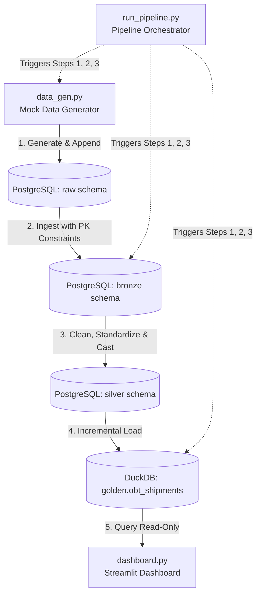

# 🚚 Logistics Analytics & Data Pipeline

Welcome! This project is a self-contained, automated data pipeline and analytics dashboard designed to ingest, clean, and visualize shipping operations data. 

It uses a **Medallion Architecture** to process raw data in PostgreSQL, transform it into a cleaned warehouse layer, and incrementally load it into a local DuckDB database to power a live Streamlit dashboard.

---

## 📊 Project Architecture at a Glance

The flowchart below shows how data flows through the system, from creation to visualization:



---

## 🛠️ The Pipeline Layers Explained

We use three database schemas (Raw, Bronze, Silver) in PostgreSQL and a final Golden table in DuckDB to process shipments:

| Layer | Database / Schema | Table Type | What Happens Here? |
| :--- | :--- | :--- | :--- |
| **Raw** | PostgreSQL (`raw`) | Ingest Dump | Freshly generated raw mock data is dumped here as-is. Columns are loose text formats, and there are no keys or constraints. |
| **Bronze** | PostgreSQL (`bronze`) | Unique Boundary | Raw records are copied here. Primary key constraints are applied to prevent duplicate rows. If a shipment's status changes, it is updated here. |
| **Silver** | PostgreSQL (`silver`) | Clean Warehouse | The data is scrubbed: invalid dates are safely removed, negative weights are nulled, shipping dates are logically corrected, and carrier names are standardized (e.g., `Fedex Express - ERR` becomes `FedEx`). |
| **Gold (OBT)** | DuckDB (`golden`) | Reporting Table | A single, highly optimized **One Big Table (OBT)** (`obt_shipments`) connects to PostgreSQL, reads new records incrementally, and makes them ready for instant querying. |

---

## 🚀 How to Run the Project

### 1. Prerequisites & Installation
Ensure you have Python 3 and PostgreSQL installed and running.

1. Clone or navigate to the project folder.
2. Initialize the virtual environment and install dependencies:
   ```bash
   python3 -m venv .venv
   source .venv/bin/activate
   pip install -r requirements.txt
   ```
3. Set up your `.env` file in the project root containing your PostgreSQL credentials:
   ```env
   DB_USER=postgres
   DB_PASS=your_postgres_password
   DB_HOST=localhost
   DB_PORT=5432
   DB_NAME=logistics_db
   ```

### 2. Run the Full Data Pipeline
To generate new mock shipments, run the PostgreSQL transformation scripts, and sync them to DuckDB in one single command:
```bash
.venv/bin/python3 run_pipeline.py
```

### 3. Launch the Streamlit Dashboard
To view the live KPIs, carrier performance charts, and shipment logs in your web browser:
```bash
.venv/bin/streamlit run dashboard.py
```
*(Open the URL printed in the terminal, usually `http://localhost:8501`.)*

---

## ⏰ Automating the Pipeline (Scheduling)

To keep your dashboard updated with fresh data automatically, you can schedule the pipeline to run periodically in the background using Linux **Cron**:

1. Open your cron editor:
   ```bash
   crontab -e
   ```
2. Add the following entry to run the pipeline **every 12 hours** (replace `/path/to/project` with your actual directory path):
   ```cron
   0 */12 * * * cd /path/to/project && .venv/bin/python3 run_pipeline.py >> pipeline.log 2>&1
   ```
3. Save and close. The system will now run the pipeline in the background and write any outputs or errors to `pipeline.log`.
